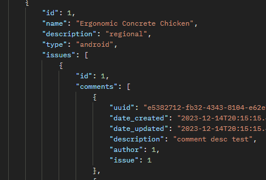

# SoftDeskSupport


## About

- An API to manage IT projects with multiples users
- Adheres to the security standards of OWASP and to the RGPD

## Features

- User can create :
  - Project with name, desc, type...
  - Issues about a project with name desc, priority...
  - Comments about an issue with desc...

- Management of read and write access rights:
  - Only the author of a ressource can update/delete it.
  - Contributors on a project can read all ressources about it (issues and comments).

## Usage

Make sure you have installed the required libraries and set up the virtual environment by executing the following commands. 
A `requirements.txt` file is provided for this purpose and can be used as follows:

```
pip install pipenv
pipenv shell
pipenv install -r requirements.txt
```

Next, run the Python script `manage.py` to run the server at http://127.0.0.1:8000/

```
python manage.py runserver
```

Now that the server is running you can use couples of requests to use the API:

### User
```
http://127.0.0.1:8000/api/user/
http://127.0.0.1:8000/api/user/{user_id}/
```
- Request content
  - username: str
  - password: str
  - birthdate: date format YYYY-MM-DD
  - can_be_shared: boolean
  - can_be_contacted: boolean

- Features
  - User can not be under 15 years (RGPD restriction)
  - Password is hashed

- Rights
  - Supervisor : POST, GET, PATCH, DELETE
  - User : POST
  - Non-loged user : POST


### Token
```
http://127.0.0.1:8000/api/token/
http://127.0.0.1:8000/api/token/refresh/

```
- Request content
  - username: str
  - password: str

- Features
  - response contents refresh and access token
    - access token lasts 5 minutes
    - refresh token lasts 24 hours
  - access token is required in header of all requests under this form
    - > Bearer {{access_token}}
  - access token can be refreshed via this request with refresh key

- Rights
  - Supervisor, User : POST
  - Non-loged user : None

### Project
```
http://127.0.0.1:8000/api/project/
http://127.0.0.1:8000/api/project/{project_id}/
```
- Request content:
  - name: str
  - description: str
  - type: "back-end", "front-end", "android", "iOS"

- Features
  - Track author, creation and modification date
  - Can have multiples issues
  - Have a list of contributor

- Rights
  - Project author: POST, GET, PATCH, DELETE
  - Project contributors: GET
  - Non-loged user: None

### Contributor
```
http://127.0.0.1:8000/api/contributor/
http://127.0.0.1:8000/api/contributor/{contributor_id}/
```

- Request content:
  - user: {user_id}
  - project: {project_id}

- Features
  - Track creation and modification date
  - Link a user with a project
  - Automatic contributor creation when a user create a new project

- Right:
  - supervisor: POST, GET, PATCH, DELETE
  - user, non-loged user: None


### Issue
```
http://127.0.0.1:8000/api/project/{project_id}/issue/
http://127.0.0.1:8000/api/project/{project_id}/issue/{issue_id}
```
- Request content:
  - name: str
  - description: str
  - priority: "LOW", "MEDIUM", "HIGH"
  - beacon: "BUG", "FEATURE", "TASK"
  - progress: "To do", "In Progress", "Finished"

- Features
  - Track author, creation and modification date
  - Can have multiples comments but only one project

- Rights
  - Issue author: POST, GET, PATCH, DELETE
  - Project contributors: GET
  - Non-loged user: None

### Comment
```
http://127.0.0.1:8000/api/project/{project_id}/issue/{issue_id}/comment/
http://127.0.0.1:8000/api/project/{project_id}/issue/{issue_id}/comment/{comment_uuid}
```
- Request content:
  - description: str

- Features
  - Track author, creation and modification date
  - Can have only one issue
  - UUID instead of incremental ID

- Rights
  - Comment author: POST, GET, PATCH, DELETE
  - Project contributors: GET
  - Non-loged user: None


## Context - Create a secure RESTful API using Django REST

- Second use of Django, this time to create an API.
- I liked a lot discovering Postman and creating a test environment inside.
- Adheres to OWASP and RGPD guidelines.
- Testing an API has been more challenging than testing a website because there is no front-end.

## Skills

- Django Rest Framework
- API creation
- SQLite Database
- Endpoint testing with Postman
- Greencode

## Credits
[Tuxiboule](https://github.com/Tuxiboule)
